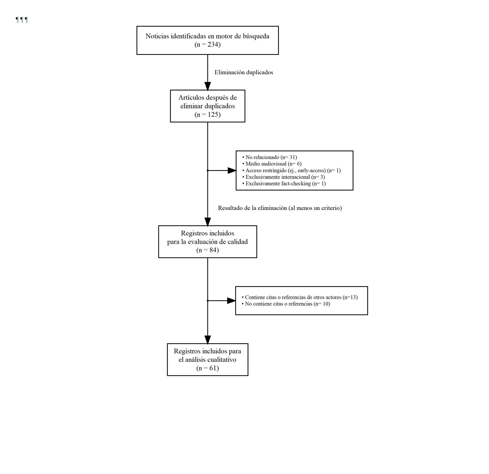

-   [Document](./_doc/pres_2022jun.html)

-   [Selected sources (Excel)](./_doc/Fuentes.xlsx)

-   [Presentation](https://docs.google.com/presentation/d/1cHEjsG1GpMKSC_QJ9f2gBOE_XYjVs7aSV7HfQZqyCZ4/edit)

-   [Data of sources in R](./_data/trabajo_20221228.RData)

-   [Data of codes and classifications in Nvivo (compressed)](test_droga_parlamentarios.rar)

The flowchart is available here:

{width="50%"}

<a href="./_fig/_flowchart_merge_formatted_4.png" target="_blank">To open in a new window</a>

<details>

<summary>Click to expand code</summary>

``` r{}
# Libraries needed
if (!require("pacman")) install.packages("pacman")
library(pacman)
pacman::p_load(survival,
               Hmisc,
               riskRegression,
               timeROC)
```

</details>
